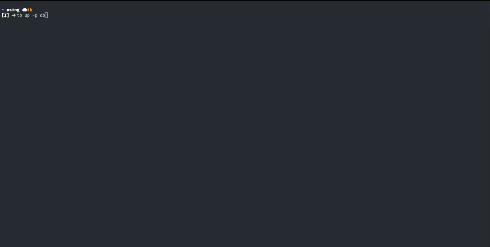

# `tb`

tb is a CLI for running services and apps on a development machine.

It is aimed at making local development easy in a complicated microservices architecture by provisioning your machine with the dependencies you need and making it easy for you to run them on your machine in an environment that is close to how they run in production.

If you want to know more about why we built `tb`, check out our [blog post](https://medium.com/touchbistro-development/tb-cli-simplifying-development-in-a-complicated-microservices-world-65da00a14c87).



### **Table of Contents**
- [Requirements](#requirements)
    + [Installed Software](#installed-software)
    + [SSH Key](#ssh-key)
- [Installation](#installation)
    + [Updating tb](#updating-tb)
- [Quickstart](#quickstart)
- [Basic Usage](#basic-usage)
- [Running Apps](#running-apps)
- [Commands](#commands)
- [Configuration](#configuration)
    + [Changing log level](#changing-log-level)
    + [Adding custom playlists](#adding-custom-playlists)
    + [Overriding service properties](#overriding-service-properties)
- [Contributing](#contributing)
- [License](#license)

## Requirements

### Installed Software

The main requirement for using `tb` is having `docker` and `docker-compose` installed.
See the [Docker installation instructions](https://docs.docker.com/get-docker/) and select your operating system for more details.

If you are using macOS having the Xcode CLI tools is also required. These can be easily installed by running `xcode-select --install`.

It is also highly recommended to install [lazydocker](https://github.com/jesseduffield/lazydocker).
This is a CLI UI that makes it easier to see the docker containers created by `tb` to run services.
See the [lazydocker installation instructions](https://github.com/jesseduffield/lazydocker#installation) to install it.

### SSH Key
`tb` uses ssh for certain git operations and assumes you have an ssh key connected to your GitHub account. If you do not have one, please create one by following the instructions [here](https://help.github.com/en/articles/connecting-to-github-with-ssh).

If your SSH key uses a passphrase, you need to ensure that it's loaded into `ssh-agent` before running tb. This can be done automatically using your MacOS keyring to automatically load the key to your shell with `ssh-add -K $HOME/.ssh/id_rsa`, which can be added to your shell configuration.

## Installation

`tb` is available through TouchBistro's `homebrew` tap. If you do not have homebrew, you can install it by going to [brew.sh](https://brew.sh)

1. Add Touchbistro's tap to get access to all the available tools:
    ```sh
    brew tap touchbistro/tap
    ```

2. Install `tb` with brew
    ```sh
    brew install tb
    ```

### Updating tb
To update to the latest version of `tb` do the following:

1. Update homebrew:
    ```sh
    brew update
    ```
2. Upgrade `tb`:
    ```sh
    brew upgrade tb
    ```

## Quickstart

To see `tb` in action you can use the [example tb-registry](https://github.com/TouchBistro/tb-registry-example).

Add the registry:
```
tb registry add TouchBistro/tb-registry-example
```

Run the `db` playlist which contains `postgres` and `redis`:
```
tb up -p db
```

## Basic Usage

By default `tb` contains no services on it's own. Run `tb list` to confirm this. This will also generate a default `~/.tbrc.yml` which will need to be edited.
To add services to `tb` you will need to add a registry. A registry is a GitHub repo that contains a list of services, playlists, and apps `tb` can run. You can read the documentation on registries [here](docs/registries.md).

Add a registry by editing `~/.tbrc.yml` and add a registry to the `registries:` section:
```yml
registries:
  - name: org/registry-name
```

You run can run a service or playlist by running `tb up -s <service>` or `tb up -p <playlist>`. `tb` will install any dependencies it needs and then start your services in docker containers.

`tb up` will start [lazydocker](https://github.com/jesseduffield/lazydocker). For more information about how to interact with it, check out [its README](https://github.com/jesseduffield/lazydocker/blob/master/README.md). You can quit lazydocker, and containers will continue to run. You can always run `lazydocker` again without having to restart your services.

Try running `tb --help` or `tb up --help` to see what else you can do.

For more information about running services in tb see the [services docs](docs/services.md).

## Running Apps
`tb` provides the ability to run iOS and desktop apps. For more information see the [tb app docs](docs/apps.md).

## Commands

`tb` comes with a lot of convenient commands. See the documentation [here](docs/commands.md) to learn more about the various features offered by tb.

Run `tb --help` to see the commands available. Run `tb <cmd> --help` to get help on a specific command.

`tb` also provides man pages which can be viewed by running `man tb` or `man tb-<cmd>` for a specific command.

## Configuration

`tb` can be configured through the `.tbrc.yml` file located in your home directory. `tb` will automatically create a basic `.tbrc.yml` for you if one doesn't exist.

### Toggling experimental mode
To to enable experimental mode set the `experimental` field to `true`. Experimental mode will give you access to any new features that are still in the process of being tested.
Please be aware that you may encounter bugs with these features as they have not yet been deemed ready for general use.
Also, experimental mode is not covered by semver guarantees, so there could be breaking changes at any time.

If you would like to help use test new features, we would appreciate it if you could enable experimental mode and report any issues you encounter.

### Adding custom playlists
You can create custom playlists by adding a new object to the `playlists` property.

Example:
```yaml
playlists:
  my-playlist:
    extends: core
    services:
      - venue-admin-frontend
      - partners-config-service
```

Each playlist can extend another playlist though the use of the `extends` property. This will add all the services from the playlist being extended to this playlist.

The services in the playlist are specified in the `services` property.

### Overriding service properties
You can override certain properties for services. To do this use the `overrides` property.

Example:
```yaml
overrides:
  TouchBistro/tb-registry/mokta:
    mode: build
  TouchBistro/tb-registry/venue-admin-frontend:
    mode: remote
    remote:
      tag: <tag name>
```

Overrides must use the full service name, i.e. `<registry>/<service>`.

You can disable using the remote version by setting `mode: build`, which will cause an image to be built from the local repo instead of pulling an image from the remote registry.

You can also use a specific image tag by setting the `remote.tag` property.

Override schema:
```yaml
<name>:
  envVars: map         # A list of env vars to set for the service, will be merged with exisiting env vars
  mode: remote | build # What mode to use: remote or build
  preRun: string       # Script to run before starting the service
  repo:
    path: string # Path to a local version of the Git repo. This will override the @REPOPATH built in variable in services.yml.
  build:               # Configuration when building the service locally
    command: string # Command to run when the container starts
    target: string  #
  remote:        # Configuration when pulling the service from a remote registry
    command: string  # Command to run when the container starts
    tag: string      # The image tag to use
```

## Contributing

See [contributing](CONTRIBUTING.md) for instructions on how to contribute to `tb`. PRs welcome!

## License

MIT © TouchBistro, see [LICENSE](LICENSE) for details.
